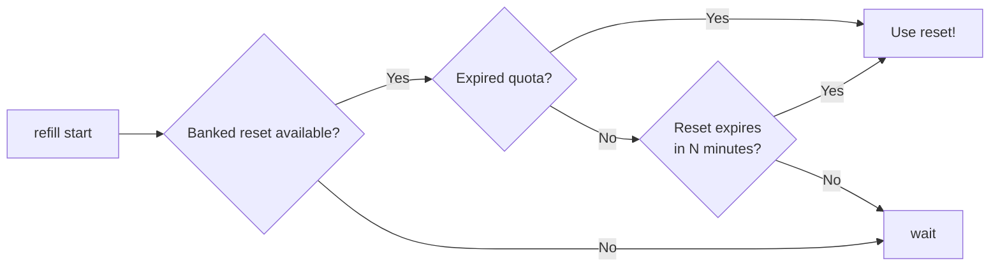

<div align="center">
   
  <p>
    <a href="https://github.com/owanesh/refill/actions/workflows/ci.yml"></a>
  </p>
  <p>
    A small macOS/Linux CLI that monitors Codex usage and automatically redeems available banked resets.
  </p>
</div>


## Requirements

- macOS or Linux, Python 3.10 or newer, and Codex CLI on `PATH`.
- For periodic checks on Linux: systemd with an available user manager
  (`systemctl --user show-environment`). No root installation is required.
- A working ChatGPT login in Codex (`codex login`).
- For periodic checks: an awake computer and a logged-in user. 

## Installation

Installing the CLI does **not** start the service or redeem a reset. 

Python package installation does not run account checks during build: `refill start` performs the prerequisite check before provisioning the service.
The preflight requires Codex on `PATH`, a ChatGPT account reported by official `account/read`, and a successful read of the usage endpoint. 
Missing Codex, missing login, API-key-only login or failed account access aborts provisioning before changing the existing service.
Use `codex login` to sign in.
A successful check does not require quota to be available or a banked reset to exist.

`refill monitor` displays the email and plan returned by `account/read`. 
Missing fields appear as `Unavailable` or `Unknown`; the plan is the server's exact plan identifier, not an inferred subscription price.
No credential files or tokens are inspected or printed.
See the [official account endpoint documentation](https://learn.chatgpt.com/docs/app-server#auth-endpoints).


### uv (recommended)

From the repository directory:

```sh
uv tool install .
refill status
refill monitor  # Read-only account check
```

If the tool directory is missing from `PATH`, use `uv tool update-shell` and open another terminal. 
See the [official uv tool guide](https://docs.astral.sh/uv/guides/tools/).

### pipx

From the repository directory:

```sh
pipx install .
refill status
refill monitor  # Read-only account check
```

Use `pipx ensurepath` if needed, then open another terminal. `pipx` accepts local directories and wheels and creates an isolated tool environment.
See the [official pipx documentation](https://pipx.pypa.io/stable/).

If switching from the standalone installer, run `refill clean` before installing with a package manager, to release the existing command name. 
`clean` deletes refill's runtime state and logs, so reconcile pending redemptions first.

### Standalone installer

This route does not require uv or pipx:

```sh
python3 install.py --no-start  # Install the CLI with the service stopped
refill monitor               # Read-only account check
```

`python3 install.py` without `--no-start` installs **and starts** the operational
service. The standalone launcher is at `~/.local/bin/refill`.

### Start the service deliberately

For all installation methods:

```sh
refill start
```

This enables an immediate check and then periodic checks every five minutes by default (configurable). 
It **may redeem a reset during the initial check** if the policy is satisfied.

The automatic policy redeems the earliest-expiring eligible reset when quota is exhausted **or** that reset expires within the configured threshold (30 minutes by default). 
It can therefore redeem while quota is still available, including while you are idle. 
The threshold refers to the banked credit's expiry, not the next natural quota reset.

## When a reset is triggered



“Expired Quota" means the server reports the usage limit reached or a Codex usage window reaches 100%. These are two signals for the same decision.

## Commands

| Command | Behavior |
| --- | --- |
| `refill status` | One line: installed, active, installed Git hash, update availability. |
| `refill config [--expiry-minutes N] [--interval-minutes M]` | Show or set expiry threshold (default: 30 min) and check interval (default: 5 min). |
| `refill monitor` | Read-only service diagnostics, configured expiry threshold, live usage and banked resets. |
| `refill start` | Install and start automatic redemption, including login startup. |
| `refill stop` | Stop the service and remove startup configuration; preserve CLI and data. |
| `refill clean` | Stop and uninstall refill, including runtime state and logs. For uv/pipx installations it also invokes the owning tool manager. |
| `refill now --force` | Attempt to redeem one eligible reset immediately, even before quota exhaustion. |

Set the threshold without starting the service:

```sh
refill config                      # Show the current threshold
refill config --expiry-minutes 60   # Redeem available resets expiring within 60 min
refill config --interval-minutes 1  # Check every minute
refill config --interval-minutes 10 # Check every ten minutes
```

The interval is a positive integer in minutes and is managed by `launchd` on macOS or a `systemd` user timer on Linux.
Changing it reloads an active service and may trigger an immediate check/redemption;
_a stopped service stays stopped._ 
Both settings can be changed in one command and are displayed in `monitor`. 
Periodic checks require an awake computer and may be delayed by sleep or an already running check.

`now --force` can consume a reset and change the next weekly reset date. 
It does not bypass workspace restrictions or invent reset credits.
An ambiguous pending attempt is reconciled using its original idempotency key. 
Repeated intentional invocations can consume additional credits when the server finds eligible usage to reset.

Dates use the computer's current OS timezone, including future daylight-saving rules, formatted `DD.MM.YY HH:MM:SS`. 


## Updating and uninstalling

For manual package-manager removal, stop/remove service data before removing the CLI environment:

```sh
refill clean
# Or: refill stop, then uv tool uninstall refill-cli / pipx uninstall refill-cli
# The latter keeps runtime state and logs.
```
Do not remove a tool environment while a configured service still references its Python runtime.

Git checks compare the installed commit with remote `main` using `git ls-remote`.

## Tests and operational details

```sh
PYTHONPATH=src python3 -m unittest discover -s tests -v
```

The tests use a fake RPC server and do not launch Codex or consume real resets.
`monitor` is always read-only. 
A real end-to-end redemption cannot be verified without actually using an eligible reset.

Runtime files are in `~/.local/share/refill`; macOS uses a LaunchAgent in
`~/Library/LaunchAgents`, and Linux uses systemd user units as described above. 
Private `.reset-state/` contains account metadata and retry keys, not login tokens.
Logs are `service.log` and `service.err.log`; 

A lock prevents overlapping redemptions. Account changes block redemption. 
A successful automatic redemption without confirmed restored access blocks further new redemptions pending manual review.
Never delete pending state to force a new attempt. `clean` removes `refill` data, not the source checkout or Codex credentials.

 

> [!NOTE]  
> Codex's “Allow Codex to use resets” setting requires you to explicitly request a reset in a conversation and have 10% or less quota remaining; **it does not use resets automatically**. 
> `refill` removes the need to remember or ask: it checks in the background and attempts redemption when quota is exhausted or an available reset expires within your chosen number of minutes. 
> With 20% quota remaining, `refill` can therefore use a soon-expiring reset that Codex's built-in setting would not use, helping you get more usage from existing resets before they expire.


<br>

**refill** _is an independent project, not affiliated with or endorsed by_ OpenAI [↗](https://openai.com/).
Codex [↗](https://openai.com/codex/) _and all other referenced names, trademarks, and logos belong to their respective owners._

 