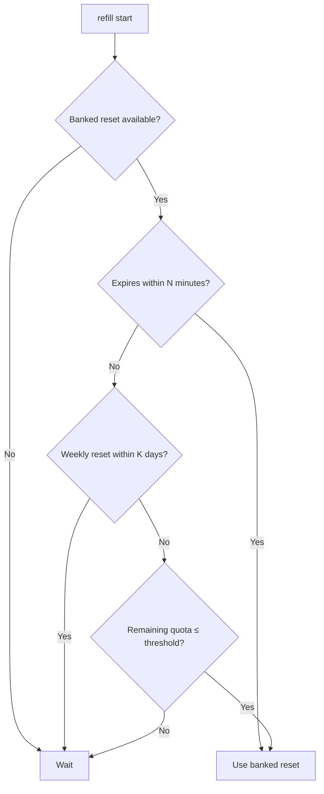

<div align="center">
   
  <p>
    <a href="https://github.com/owanesh/refill/actions/workflows/ci.yml"></a>
  </p>
  <p>
    A small macOS/Linux CLI that monitors Codex usage and automatically redeems available banked resets.
  </p>
</div>


## Requirements

- macOS or Linux, Python 3.10 or newer, and Codex CLI on `PATH`.
- For periodic checks on Linux: systemd with an available user manager
  (`systemctl --user show-environment`). No root installation is required.
- A working ChatGPT login in Codex (`codex login`).
- For periodic checks: an awake computer and a logged-in user. 

## Installation

Installing the CLI does **not** start the service or redeem a reset. 

Python package installation does not run account checks during build: `refill start` performs the prerequisite check before provisioning the service.
The preflight requires Codex on `PATH`, a ChatGPT account reported by official `account/read`, and a successful read of the usage endpoint. 
Missing Codex, missing login, API-key-only login or failed account access aborts provisioning before changing the existing service.
Use `codex login` to sign in.
A successful check does not require quota to be available or a banked reset to exist.

`refill monitor` displays the email and plan returned by `account/read`. 
Missing fields appear as `Unavailable` or `Unknown`; the plan is the server's exact plan identifier, not an inferred subscription price.
No credential files or tokens are inspected or printed.
See the [official account endpoint documentation](https://learn.chatgpt.com/docs/app-server#auth-endpoints).


### uv (recommended)

From the repository directory:

```sh
uv tool install .
refill status
refill monitor  # Read-only account check
```

If the tool directory is missing from `PATH`, use `uv tool update-shell` and open another terminal. 
See the [official uv tool guide](https://docs.astral.sh/uv/guides/tools/).

### pipx

From the repository directory:

```sh
pipx install .
refill status
refill monitor  # Read-only account check
```

Use `pipx ensurepath` if needed, then open another terminal. `pipx` accepts local directories and wheels and creates an isolated tool environment.
See the [official pipx documentation](https://pipx.pypa.io/stable/).

If switching from the standalone installer, run `refill clean` before installing with a package manager, to release the existing command name. 
`clean` deletes refill's runtime state and logs, so reconcile pending redemptions first.

### Standalone installer

This route does not require uv or pipx:

```sh
python3 install.py --no-start  # Install the CLI with the service stopped
refill monitor               # Read-only account check
```

`python3 install.py` without `--no-start` installs **and starts** the operational
service. The standalone launcher is at `~/.local/bin/refill`.

### Start the service deliberately

For all installation methods:

```sh
refill start
```

This enables an immediate check and then periodic checks every five minutes by default (configurable). 
It **may redeem a reset during the initial check** if the policy is satisfied.

Refill selects the earliest-expiring eligible banked reset. It first checks whether
that credit is about to expire; otherwise it waits for a nearby weekly reset,
then checks the remaining quota threshold. Account/workspace safety checks and
the one-hour automatic redemption cooldown always apply.

## When a reset is triggered

<details>
<summary>View the reset decision flow</summary>
  

  
</details>


## Commands

| Command | Behavior |
| --- | --- |
| `refill status` | One line: installed, active, installed Git hash, update availability. |
| `refill config [options]` | Show or change the reset policy and check interval. |
| `refill monitor` | Read-only service diagnostics, all policy settings, live usage and banked resets. |
| `refill start` | Install and start automatic redemption, including login startup. |
| `refill stop` | Stop the service and remove startup configuration; preserve CLI and data. |
| `refill clean` | Stop and uninstall refill, including runtime state and logs. For uv/pipx installations it also invokes the owning tool manager. |
| `refill now --force` | Attempt to redeem one eligible reset immediately, even before quota exhaustion. |

Configuration is saved in `~/.local/share/refill/config.json` on both platforms.
It survives stop/start, reinstalls and updates; `clean` removes it.

| Option | Default | Meaning |
| --- | --- | --- |
| `--expiry-minutes N` | `30` | Use a banked reset expiring within N minutes, even with quota remaining or a nearby weekly reset. `0` disables this trigger. |
| `--weekly-reset-days K` | `1` | Otherwise wait if the weekly reset is within K × 24 hours. `1` means the next 24 hours, not the next calendar date; `0` disables waiting. Decimal days are supported: `0.5` = 12 hours, `0.55` = 13 hours 12 minutes. |
| `--quota-threshold P` | `0` | Otherwise use a banked when any Codex window has P% or less remaining. `0` waits for exhaustion; `1` allows activation at 1% remaining. Use whole percentages from 0 to 100; decimal quota precision is currently unavailable from Codex. |
| `--interval-minutes M` | `5` | Check every M minutes (positive integer). Changing it reloads an active service; a stopped service stays stopped. |

```sh
refill config                                      # Show all settings
refill config --quota-threshold 1 --weekly-reset-days 2
refill config --weekly-reset-days 0.5              # Wait for a weekly reset within 12 hours
refill config --expiry-minutes 60 --interval-minutes 1
```

Days can be decimal: `0.5` means 12 hours and `0.55` means 13 hours and 12 minutes.
The quota threshold must be a whole number from 0 to 100. Codex does not provide
decimal quota values. A threshold of `1` includes exactly 1% remaining.

With the default settings, Refill waits if your quota is empty but the weekly
reset is within the next 24 hours. It still uses a banked reset if that credit
expires within 30 minutes. If Refill cannot determine when the weekly reset is,
it waits; set `--weekly-reset-days 0` to disable this waiting rule.

New settings take effect at the next check. Use `refill monitor` to see them.
Your computer must be awake for checks to run. `--wait-minutes` is another name
for `--expiry-minutes`.

`refill now --force` attempts to use a banked reset immediately, ignoring these
thresholds and the one-hour cooldown. Account and workspace restrictions still
apply. Using a reset may change your next weekly reset date. Running this command
again may consume another credit. If a previous attempt has an uncertain result,
Refill checks that attempt again before starting a new one.


## Uninstalling

For manual package-manager removal, stop/remove service data before removing the CLI environment:

```sh
refill clean
# Or: refill stop, then uv tool uninstall refill-cli / pipx uninstall refill-cli
# The latter keeps runtime state and logs.
```
Do not remove a tool environment while a configured service still references its Python runtime.


> [!NOTE]  
> Codex's “Allow Codex to use resets” setting requires you to explicitly request a reset in a conversation and have 10% or less quota remaining; **it does not use resets automatically**. 
> `refill` removes the need to remember or ask: it checks in the background and attempts redemption when quota is exhausted or an available reset expires within your chosen number of minutes. 
> With 20% quota remaining, `refill` can therefore use a soon-expiring reset that Codex's built-in setting would not use, helping you get more usage from existing resets before they expire.


<br>

**refill** _is an independent project, not affiliated with or endorsed by_ OpenAI [↗](https://openai.com/).
Codex [↗](https://openai.com/codex/) _and all other referenced names, trademarks, and logos belong to their respective owners._

 