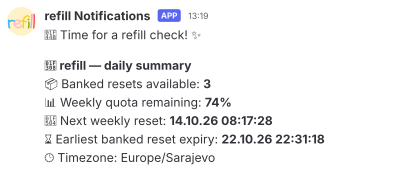

# refill-notify
Optional web notifications for `refill`; works with Discord, Slack, ntfy and generic JSON webhooks.

## Install

From the repository, for a new installation:

```sh
uv tool install '.[notify]'
# Or: pipx install '.[notify]'
```

### Already have `refill`?
Add the extra by reinstalling:

```sh
uv tool install --reinstall '.[notify]'
# Or: pipx install --force '.[notify]'
```

Reinstallation preserves your configuration and reset state.
If the service was already installed, run `refill start` once to refresh its code.
For the standalone route, install the extra into a persistent virtual environment first, then run that environment's `python install.py --no-start`.
Do not delete its Python environment while the service uses it.

`refill update` keeps the extra when updating uv/pipx installations.

## Configure

```sh
refill config --webhook-format discord --webhook-url 'https://discord.com/api/webhooks/ID/TOKEN'
refill config --summary-prefix 'Here is your refill update ✨'
refill config --daily-summary-time 09:00
refill notify --summary  # Send a summary of live quota; never redeems a reset
```

| Option | Meaning |
| --- | --- |
| `--webhook-format` | `discord`, `slack`, `ntfy`, or `generic` (default). |
| `--webhook-url` | HTTPS destination. An empty string disables all web notifications. |
| `--summary-prefix` | Personal text before the message, up to 500 characters. Empty clears it. |
| `--daily-summary-time` | Local time as `HH:MM`. Empty disables daily summaries; disabled by default. |

For ntfy, use a topic URL such as `https://ntfy.sh/YOUR_UNGUESSABLE_TOPIC` that allows publishing without a separate token
. For Slack, use an Incoming Webhook URL.
Protected ntfy topics requiring separate headers are not supported in this version.
The generic format sends `{"event": "daily_summary", "message": "..."}`.

> [!TIP]
> For real Discord user mentions, put `<@USER_ID>` in the prefix.
> Only those explicit user IDs can ping; `@everyone` and role pings are disabled.
> Discord messages are limited to 2,000 characters.

## What gets sent

After a confirmed reset, `refill` sends a **banked reset used** notification alongside the existing system notification.
An optional **daily summary** includes available banked resets, remaining quota, reset times and the earliest banked expiry.

Daily summaries are sent at the first service check after the chosen time, once per local day and destination after successful delivery.
If the computer sleeps, the summary arrives when checks resume.
The service must be active.
A failed summary is retried at later checks; an uncertain network result may cause a duplicate.
Reset notifications are best-effort and do not retry the redemption itself.

URL and prefix are hidden in `monitor`, configuration output and error messages.

Settings live in `~/.local/share/refill/config.json`, written with owner-only permissions.
Webhooks receive usage data, never account emails, account IDs or Codex credentials.
